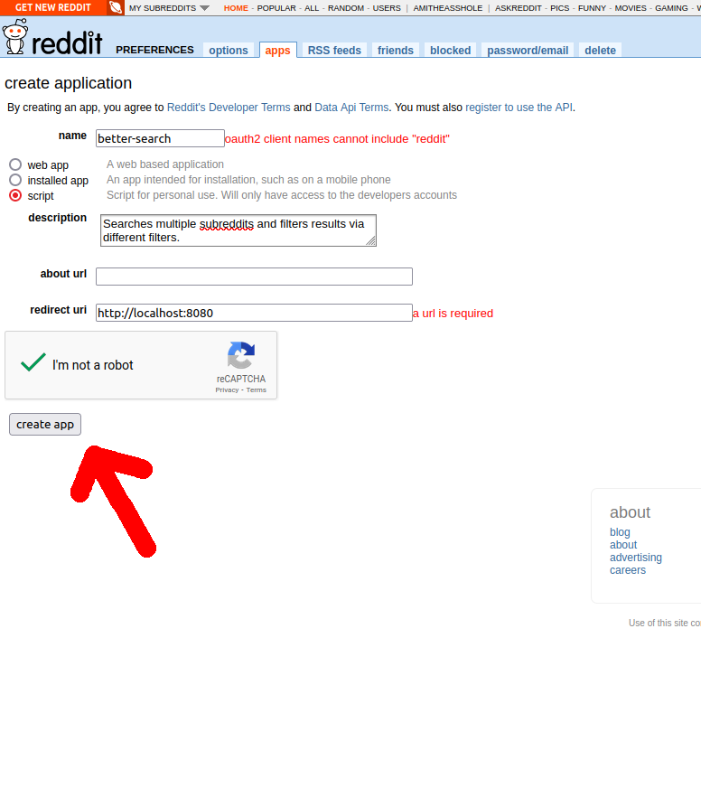
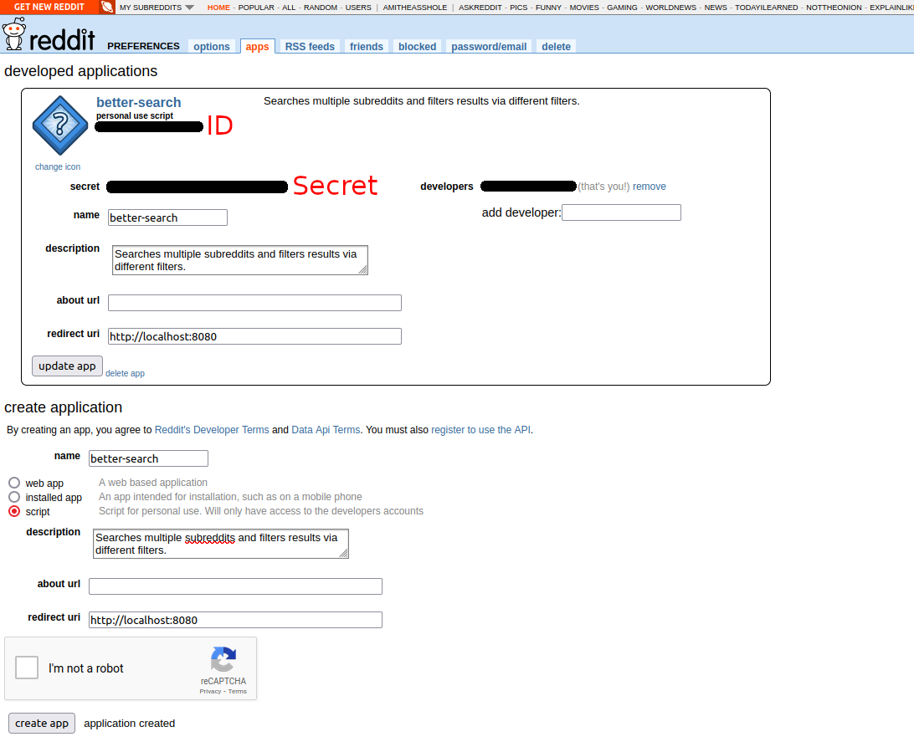
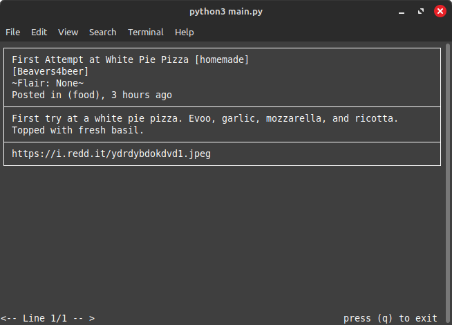

# RedditSearch

Searches subreddits and filters by flair or title.

This program is built for and has only been tested on Linux.

**Tested Python versions**: 3.12-3.13

# Installation

1. Clone the repository locally or download and extract the zipped folder.
2. Open config.py
3. Navigate to https://old.reddit.com/prefs/apps/
    1. If you have an account, login, if not, create an account
    2. Click on "are you a developer? Create an app..."
    
    3. Enter "better-search" for the name of the app
    4. Enter "Searches multiple subreddits and filters results" for the description
    5. Enter "http://localhost:8080" for the redirect uri
    
    6. Click on "create app"
    7. In the top left will be a picture of a question mark inside of a diamond
        * To the right of this should be "better-search" and then "personal use script" below that. Below this will be a string of random characters. This is your client id. Navigate to config.py and replace the text that says "your_client_id" with this string.
        * Back on the website, below the client id, should be a section labelled "secret" copy this and replace "your_client_secret" with it.
        * Finally, within the user agent section on config.py, replace your_username with your Reddit username.
        
        
    * It is now safe to close the browser window.
* (Optional) the path in searches_file can be edited to specify a different file to store saved searches
* (Optional) the path in link_output can be edited to specify a different file to save urls too. See the [Interacting](#interacting) section for more information about this.
* (Optional) If you prefer to not use fancy characters, or your computer does not support them, change the value of fancy_characters to false. This will force the app to use only ASCII characters.

8. Install Python 3 and PIP
    * For ubuntu or Debian based systems:  
        `sudo apt install python3 python3-pip`
9. Install required libraries. They can be found in requirements.txt. Run:  
`pip install -r requirements.txt`
10. For clipboard functionality, either xclip or xsel is needed. Check if they are installed with `sudo apt show xclip` or `sudo apt show xsel` See the pyperclip documentation (https://pypi.org/project/pyperclip/) for more information.

# Usage


The program can be started by executing the following command:  
    `python3 main.py`

If you receive a message stating that there was a bad HTTP response, you likely have a mistake in your config file. Ensure that the tokens are correct, in quotes, and do not have extra spaces within the quotes.


The next screen should be a list of names of searches. If the screen states that no searches were found, double check the path to the searches file in config.py. 


Is that the correct path? If it is, press any key in the terminal to start the process of creating a new search. If it is not, edit the value in config.py, press 'q' in the terminal, and relaunch the program.

## Creating a search

There are two methods for creating searches: [within the app](#in-app) (easier / recommended) or using [JSON](#json) (advanced / better for power users). 

### Filters

There are three different groups of filters and two different filters in each group. The groups are as follows:  
* Title: this is a word or phrase that exists in the title of the post  
* Flair: this is a word of phrase that exists in the flair of the post. This typically comes after the title on the Reddit site, and is enclosed in some colored oval  
* Post: this is a word or phrase that exists in the main body of the post. It is in the actual contents of the post.

Within each of these groups, there is a blacklist and a whitelist. Blacklisted filters are those that you do not want to see. Whitelisted filters are the ones that will show up as a result of the search. Blacklisted flairs exist to specify certain topics in your results that you do not want to see. Here is an example: 

Lets suppose that you want to perform a search on the Food subreddit, and you are looking for posts that mention pizza, but you absolutely despise onions on pizza. The search for this would look something like this:  
* Pizza -> This is the name of the search (it can be anything)
    * Subreddit: Food -> This is the subreddit that the following rules will apply to
        * Whitelisted Title: pizza -> All posts with the word pizza in the title will be included
        * Blacklisted Title: onion -> All posts with the word onion in the title will be excluded.

Note that posts with a blacklist match will be excluded before posts with a whitelist match will be included. Thus, a post with the title "A delicious onion pizza" will be excluded because the blacklist has higher precedence than the whitelist.


### In app
1. On the search creation screen, you will first be prompted to enter the name of the search. This will be the name referenced when you go to perform the search, so choose something relevant and descriptive.
2. You will then be prompted to enter the name of a subreddit. This is the subreddit that the rules you will define next will be applied to.
3. Next comes the whitelisted titles. You can add as many different words or phrases. Simply press 'y' to add a new white listed title. Then enter the word or phrase then press enter. You will be brought back to the same prompt asking for a whitelist title. Continue this loop until you are finished, then press 'n' to move on.
4. The same process continues, but this time with the blacklisted titles.
5. Repeat this process for the whitelisted flair, blacklisted flair, whitelisted word, and blacklisted word.
6. You will then be prompted if you want to add another subreddit. If you would like to search across multiple subreddits, press 'y', if not press 'n' to finish.
    * Note that filters are unique to the subreddit that they are defined for.

7. You will then be brought to a screen that has a list of names of searches. You should see the one you just created at the bottom of this list.


### JSON 

Search objects are stored using Javascript Object Notation (JSON), and are stored inside a single file. By default, this file is "searches.json", but this can be changed by editing the value of "searches_file" in "config.py". These instructions will only include the necessities for creating a search object, but plenty of information can be found about it online. If you would like a reference file, one can be found at: "https://github.com/JMGillum/RedditSearch/blob/36b614b9bc63dd9ba60acaf38949963f24e5cef4/searches.json". To create a search using JSON, open the searches file using a text editor, then:

1. Insert opening and closing curly braces "{}". All of your searches will be housed within these braces.
2. Type `"searches": []` Note that you must include the quotes around searches. The square braces indicate that the value of searches will be a list. Inside of these square braces will be a list of different searches.
3. Each search is its own object. Objects in JSON must be enclosed in curly braces, so include another set of them inside of the square braces.
    * So far your file should look like this:  
    ```{"searches":[{}]}```
    * It is typically helpful to seprate items onto newlines. Thus, the following is also valid:
    ```
    {
        "searches": [
            {

            }
        ]
    }
    ```

4. Within these inner braces will be your search object. Start by adding "name": (make sure to include the quotes), then type the name you would like to give the search, also enclosed in quotes, followed by a comma.

5. Next we need to add the time that this search was last performed. This tells the program how far back to search when it performs the search. Add `"lastSearchTime": null`,

6. Next comes the subreddit objects. This is a list of collections of filters applied to a subreddit. If you would like to search multiple subreddits at a time, you need to define the filters for each subreddit individually. Add: "subreddits": [{}]

    ```
    {
        "searches": [
            {
                "name": "food",
                lastsearchTime: null,
                "subreddits": [
                    {

                    }
                ]
            }
        ]
    }
    ```

7. Next, add the sections for each of the 6 filters. Your file should now look like this:
    ```
        {
            "searches": [
                {
                    "name": "food",
                    lastsearchTime: null,
                    "subreddits": [
                        {
                        "name": ,
                        "whiteListTitle": [],
                        "blackListTitle": [],
                        "whiteListFlair": [],
                        "blackListFlair": [],
                        "whiteListPost": [],
                        "blackListPost": []
                        }
                    ]
                }
            ]
        }
    ```
    * Notice that there is a comma after each element, except after the last one. This is one of the rules of JSON. It is like describing a list of different items.
8. Add the name of the subreddit that these filters will apply to after "name". Make sure it is enclosed in quotes, and that is is in all lowercase characters. 
9. For each filter you would like to use, add different words or phrases, enclosed in quotes, and separated by commas. These should go within their respective square braces. For my example, I will look for hotdogs and hamburgers, and exclude healthy vegetables. My search would look like this:
    ```
        {
            "searches": [
                {
                    "name": "food",
                    lastsearchTime: null,
                    "subreddits": [
                        {
                            "name": "food",
                            "whiteListTitle": [
                                "hotdog",
                                "hamburger"
                            ],
                            "blackListTitle": [
                                "vegetable",
                                "veggies",
                                "fruit",
                                "healthy"
                            ],
                            "whiteListFlair": [
                                "OC",
                                "Recipe In Comments"
                            ],
                            "blackListFlair": [
                                "Vegetarian",
                            ],
                            "whiteListPost": [
                                "Delicious",
                                "Gourmet",
                                "Amazing"
                            ],
                            "blackListPost": [
                                "Disgusting",
                                "Gross",
                                "Horrible"
                            ]
                        }
                    ]
                }
            ]
        }
    ```
9. If you would like to search another subreddit during this search as well, add a comma after the closing brace of the previous, and repeat the same process.
    ```
        {
            "searches": [
                {
                    "name": "food",
                    lastsearchTime: null,
                    "subreddits": [
                        {
                            "name": "sub1",
                            ...
                        },
                        {
                            "name": "sub2",
                            ...
                        }
                    ]
                }
            ]
        }
    ```
10. If you wouldl like to define another search, add a comma after the ending curly brace of the previous search, then define another.
    ```
        {
            "searches": [
                {
                    "name": "search1",
                    ...
                },
                {
                    "name": "search2",
                    ...
                }
            ]
        }
    ```

11. Save the file, then execute the program. Do note that changes to this file must be made while the program is **NOT** running.


## Search Selection

On the screen listing searches, you have several options. 
*   Pressing 'a' will allow you to create a new search. Reference the [Creating a search](#creating-a-search) section for help with this.
*   Pressing 'e' will allow you to enter a number. This search will then be run. See the Results section for the next steps.
*   Pressing 'd' will also allow you to enter a number, this search will be deleted from the list *Warning! This can not be undone*
*   Pressing 'v' will allow you to enter a number. This search will then be displayed in a tree form. This is useful for seeing the filters and parameters of the search.
*   Pressing 'q' will close the program.    

## Results

* While the search is being performed, you will see a screen that says "Searching..." simply wait and let the search commences.

* After the search is finished, you will see boxes stacked on top of each other vertically. These are the "headers" of your results. Each box corresponds to a single post within your criteria. They each contain the following: 
    * A number followed by ): This is the reference number in the list of results. More on this later
    * Immediately following the reference number is the title of the post.
    * On a new line is author of the post, surrounded by square brackets
    * On another new line is the flairs that the author set for the post
    * Finally, is the subreddit that the post is in, as well as its age. 
        * Note that the age is rounded down to the closest significant time period. For example a post that is 80 minutes old will be described as being 1 hour old. A post that is 3 days, 6 hours, and 42 minutes old will be described as being 3 days old.


* The list of boxes can be scrolled through. Pressing the 'w' key or up arrow will scroll everything up a single line. Pressing the 's' or down arrow key will scroll everything down a single line. You can also hold down these keys to scroll faster, and most terminals should allow you to use a mousewheel as well.
* Besides scrolling through the list, you have three other options for input:
    * Pressing 'e' will allow you to enter a number. This number should correspond to a reference number of one of the posts. This will pull up a full screen view of the post, and will contain the actual body text of the post. Reference the Viewing a post section for the next steps.
    * Pressing 'r' will refresh the page. The search will be performed again and any new posts since the last search will be added to the top of the list.
    * Pressing 'q' will quit the program.


## Viewing a post

* Posts viewed in full consist of three parts:
    * Head section. This is the first box. Notice that it contains the same contents as the headers found in the navigating results section. Reference the [Results](#results) section for a description of these.
    * Body section. This contains the actual text of the post.
    * Foot section. This contains the url of the post. Note that due to limitations of the terminal, this link can not be clicked on. You will have to manually copy it over if you want to use it. This link is simply for information. More efficient methods exist for opening the link in a brower, and are described in [Interacting](#interacting)



* There are numerous different shortcut keys for different actions that can be performed in this section:
    * Pressing 'h' will bring up a cheatsheet help menu with a description of the available shortcuts. Press any key after this to return to the post.

    ### Navigation

    * Pressing or holding 'w' or the up arrow will scroll up through the post
    * Pressing or holding 's' or the down arrow will scroll down through the post
    * Pressing 'a' or the left arrow will shift to the previous post in the list.
    * Pressing 'd' or the right arrow will shift to the next post in the list
    * Press 'q' to return to the screen with all of the post headers. Refer to the [Results](#results) section for details on this area

    ### Interacting

    * Pressing 'i' will open up the image of the post, if it is an image post instead of a text post.
        * An image post can usually be discerened by the URL at the bottom. It will typically start with "i.redd.it/" and/or it will end with an image's file extension (ex: .jpg, .png)
    * pressing 'o' will open the post up on the official Reddit website, in your default web browser
    * Pressing 'u' will shift to another screen that displays a file name. All of the links in the post have been written to the file. Links are written in the order they are added. So the newest links will be at the bottom of the file. After you have viewed the links, it is safe to delete them from the file.
    * Pressing 'm' will open up the page of the author on the official Reddit website, in your default web browser.


## Advanced

* If you know which search you want to perform ahead of time, you can save time by specifying it in the command line. To do this, run:  
`python3 main.py -n <search_name>`  
 Do note that search names are case sensitive, such that "mysearch" is not the same as "MYSEARCH". If you specify a search that does not exist, the program will list out all available searches that are present in the specified search file. 
* Adding a '-d' flag prevents the lastSearchTime from being modified. This is useful if you want to run the search over the same timeframe multiple times.
* Adding a '-y' flag will automatically agree to prompts asking if you want to run a search that hasn't be run in a while (typically over a week)


# Known Issues:

* Terminal resizing is only supported on the search in progress, browsing, and post viewing screens.